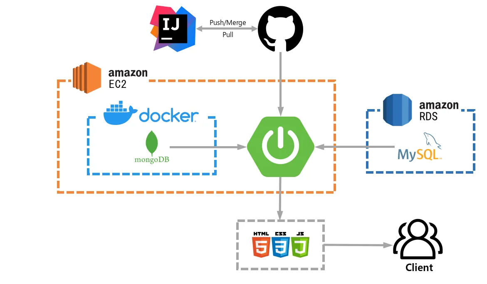
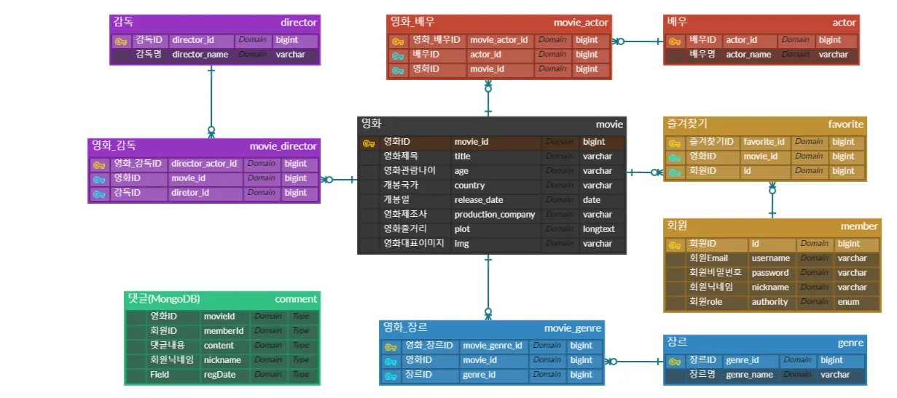

<h1>Minicinema🎬 </h1>

<strong>사용자 맞춤형 서비스를 제공하는 영화 커뮤니티</strong>

<!--
-->

<h2>프로젝트 개요</h2>

<table>
  <tr>
    <td width=15%><strong>개요</strong></td>
    <td>영화 데이터와 관련된 다양한 정보를 관리하고, 사용자 간의 소통을 지원하는 커뮤니티입니다. 주요 기능으로는 영화, 배우, 감독 등 다양한 분류와 검색어를 통해 효율적으로 영화를 검색하고 자세한 정보를 조회할 수 있습니다. 또한, 영화 정보 및 회원 정보를 기반으로 댓글 및 즐겨찾기 기능을 통해 사용자 맞춤형 서비스를 제공합니다.</td>
  </tr>
  <tr>
    <td><strong>진행 기간</strong></td>
    <td>2024.09.09 ~ 2024.09.25</td>
  </tr>
  <tr>
    <td><strong>팀 구성</strong></td>
    <td>개인 프로젝트</td>
  </tr>
  <tr>
    <td><strong>기술 스택</strong></td>
    <td><code>Java17</code> <code>Python</code> <code>Spring Boot 3.3.1</code> <code>Spring Security</code> <code>Spring Data JPA</code> <code>MyBatis</code> <code>MySQL</code> <code>MongoDB</code> <code>Thymeleaf</code> <code>Selenium</code> <code>AWS RDS</code> <code>AWS EC2</code></td>
  </tr>
  <tr>
    <td><strong>GitHub</strong></td>
    <td><a href="https://github.com/MindySo/minicinema">https://github.com/MindySo/minicinema</a></td>
  </tr>
  <tr>
    <td><strong>URL</strong></td>
    <td><a href="http://3.38.94.145:8080/">http://3.38.94.145:8080/</a></td>
  </tr>
</table>

<h2>System Architecture</h2>

  

<h2>ERD</h2>

  

<h2>⚙ 기술적 경험</h2>
<ul>
  <li><strong>회원가입 및 Spring Security를 활용한 로그인·로그아웃 구현</strong></li>
  <ul>
      <li>로그인 시 <code>JWT</code> 토큰을 발급하여 유효성 검증, 로그아웃 시 만료 처리</li>
      <li><code>Access Token</code>과 <code>Refresh Token</code>을 함께 사용하여 보안 강화</li>
  </ul>
   

  <li><strong>MyBatis 와 JPA를 함께 사용</strong></li>
  <ul>
      <li>간단한 쿼리로 수행 가능한 기능은 <code>JpaRepository</code>에서 제공하는 메서드를 사용</li>
      <li>join, where 등이 포함된 복잡한 쿼리 수행 시 <code>MyBatis</code>를 통해 쿼리문과 직접 매핑하여 개발</li>
  </ul>
   

  <li><strong>jasypt를 사용한 애플리케이션 설정 암호화</strong></li>
  <ul>
      <li>애플리케이션 배포 시 DB정보 및 secret-key의 유출 방지를 위해 <code>jasypt</code>로 암호화</li>
      <li>암호화 된 값들은 <code>spring.profiles.active</code> 설정을 통해 파일을 따로 분리하여 관리</li>
  </ul>
   

  <li><strong>MongoDB를 사용하여 댓글 기능 구현</strong></li>
   

  <li><strong>Selenium을 이용한 정보 크롤링</strong></li>
  <ul>
    <li><code>Selenium</code>을 사용한 브라우저 동작 자동화로 KMDb에서 영화 정보 크롤링</li>
  </ul>
   

  <li><strong>AWS EC2를 통해 배포</strong></li>
  <ul>
      <li>EC2에 키를 가지고 통신하여 <code>Github</code> clone 및 pull하여 배포와 차후 관리</li>
    </ul>
</ul>

<h2>🔐 로그인 및 로그아웃 기능</h2>

- 로그인 시 **`JWT`** 방식으로 유효기간이 짧은 `Access Token`과 긴 `Refresh Token`을 함께 발급
    

    
- `Access Token`이 만료될 경우 `Refresh Token`의 유효성 검사 후 `Access Token` 재발급
- 로그아웃 시  `Refresh Token` 만료 처리

<h2>🎞 영화 전체 조회 및 검색 기능</h2>

<table>
  <tr>
    <td width="50%" valign="top">
        
    </td>
    <td width="50%"  valign="top">
      <ul>
        <li><code>Spring Pageable</code>을 사용하여 페이징 처리</li>
   
        <li><code>MyBatis</code>를 사용하여 통합검색 및 카테고리에 따른 검색어 조회 기능 구현</li>
       
      
<em>▲ 카테고리별 검색 기능</em>

   
        <li>각 영화 선택 시 상세정보 조회 가능</li>
      </ul>
    </td>
  </tr>
</table>

<h2>⭐ 영화 즐겨찾기 및 댓글 기능</h2>

<table>
  <tr>
    <td width="50%" valign="top">
        
    </td>
    <td width="50%"  valign="top">
      <ul>
        <li>영화 상세정보 페이지에서 비동기 방식으로 영화 즐겨찾기 선택 · 취소 구현</li>
   
        <li>유저가 즐겨찾기한 영화는 즐겨찾기 목록에서 전체조회 및 상세조회 가능</li>
         
        
<em>▲ 즐겨찾기 목록</em>

   
        <li>해당 영화와 같은 장르의 영화를 조회하여 비슷한 영화로 추천</li>
   
        <li><code>MongoDB</code>와 <code>JPA</code>를 활용하여 댓글 CRUD 기능 구현</li>
      </ul>
    </td>
  </tr>
</table>
 
