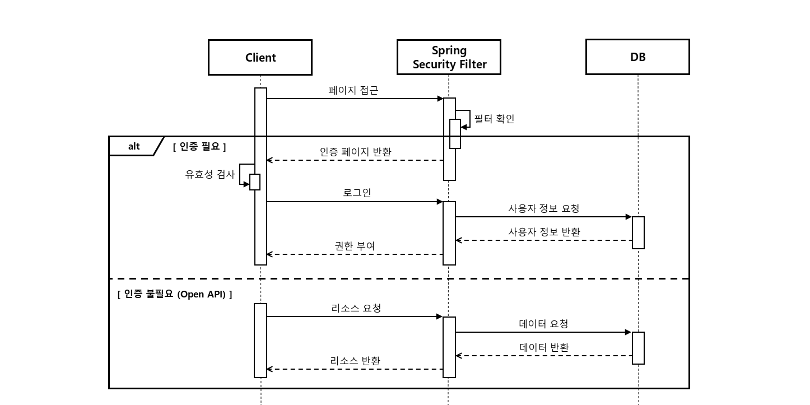
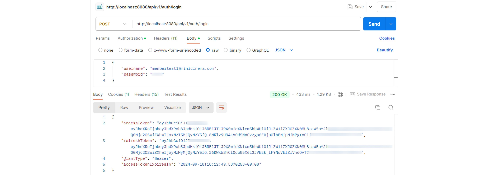
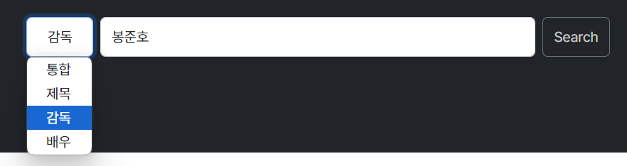
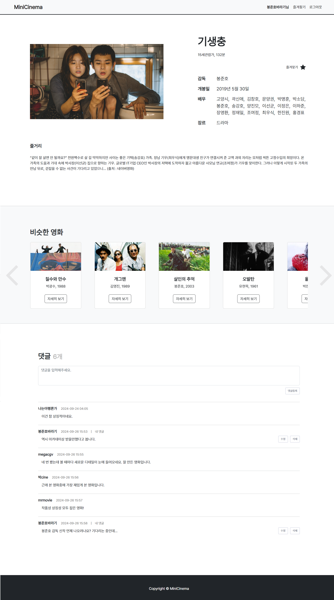
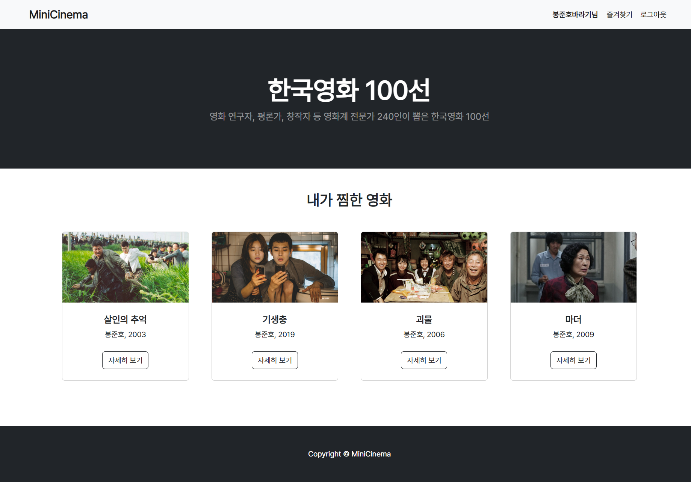

# 🎬 Minicinema

> 사용자 맞춤형 서비스를 제공하는 영화 커뮤니티

| 항목 | 내용 |
|------|------|
| **개요** | 영화 데이터와 관련된 다양한 정보를 관리하고, 사용자 간의 소통을 지원하는 커뮤니티입니다. 영화, 배우, 감독 등 다양한 분류와 검색어를 통해 효율적인 검색 및 상세 조회가 가능하며, 댓글 및 즐겨찾기 기능도 제공합니다. |
| **진행 기간** | 2024.09.09 ~ 2024.09.25 |
| **팀 구성** | 개인 프로젝트 |
| **기술 스택** | `Java17`, `Python`, `Spring Boot 3.3.1`, `Spring Security`, `Spring Data JPA`, `Mybatis`, `MySql`, `MongoDB`, `Thymeleaf`, `Selenium`, `AWS RDS`, `AWS EC2` |
| **GitHub** | [https://github.com/MindySo/minicinema](https://github.com/MindySo/minicinema) |
| **URL** | [http://3.38.94.145:8080/](http://3.38.94.145:8080/) |

---

## 🏗 System Architecture

용.png)

---

## 🧩 ERD

용.png)

---

## ⚙️ 기술적 경험

- **회원가입 및 Spring Security 기반 로그인/로그아웃**
  - JWT 발급 및 만료 처리
  - `Access Token` + `Refresh Token` 구조
- **MyBatis + JPA 혼합 사용**
  - 간단한 쿼리: `JpaRepository`
  - 복잡한 쿼리: `MyBatis`
- **jasypt 설정 암호화**
  - DB 정보, secret-key 보안 처리
- **MongoDB로 댓글 기능 구현**
- **Selenium으로 영화 정보 크롤링**
- **AWS EC2 + Github 연동하여 배포 자동화**

---

## 🔐 로그인 및 로그아웃

- JWT 방식 인증 및 재발급
- 로그아웃 시 Refresh Token 만료 처리

---

## 🔍 영화 전체 조회 및 검색 기능

- `Spring Pageable`로 페이징 구현
- `MyBatis`로 통합 검색 및 카테고리 필터 구현

▲ 카테고리별 검색 기능

---

## ⭐ 즐겨찾기 및 댓글 기능

- 비동기 방식 즐겨찾기 추가/삭제
- 즐겨찾기 목록 페이지에서 전체/상세조회 가능

▲ 즐겨찾기 목록 및 추천 영화

- 같은 장르의 영화 추천 기능
- `MongoDB`, `JPA` 기반 댓글 CRUD 구현
